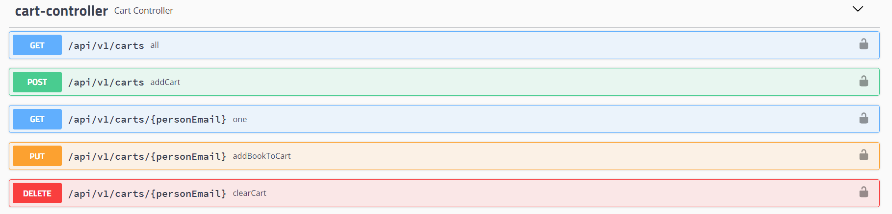

# SKE Project
##[GitHub Link](https://github.com/ZSzymon/BookStore-BE) 
#### Developers recommendations

* Use a [IntelliJ IDEA Ultimate](https://www.jetbrains.com/lp/intellij-frameworks/)
* Use a [API-DOCS](http://localhost:8080/swagger-ui.html)
* Use a [Mongo Express](http://localhost:8081)
#### Requirements

* [ Maven](https://maven.apache.org/)
    - [Windows](https://mkyong.com/maven/how-to-install-maven-in-windows/)
    - [Linux](https://maven.apache.org/install.html)
* [ Docker](https://www.docker.com/)

#### User manual

1. Run docker
    ````
    docker-compose up -d 
    ````

2. Run BookStore application
    ```
    mvn spring-boot:run
    ```
3. Register to API:

  ```
    curl --location --request POST 'http://localhost:8080/api/auth/signup' \
--header 'Content-Type: application/json' \
--data-raw '{
    "username": "user",
    "email": "user@gmail.com",
    "password": "password"
}'
  ```
4. Login to API:
  ```
    curl --location --request POST 'http://localhost:8080/api/auth/signin' \
    --header 'Content-Type: application/json' \
    --data-raw '{
        "username":"admintest",
    "password":"password"
    }'
  ```
5. If authorization is turn on you can make GET request. If you want to make any other request you have to provide authorization token in request header.
  ```
    curl --location --request GET 'http://localhost:8080/api/test/admin' \
    --header 'Authorization: Bearer token'
  ```

#### Default users
Credentials for default users
 ##### Admin
    login: admin  
    email: admin@gmail.com  
    password: password  
    role: admin  
##### User
    login: user  
    email: user@gmail.com  
    password: password  
    role: user
##### Moderator
    login: mod  
    email: mod@gmail.com  
    password: password  
    role: mod

### Example uses
Example uses of each endpoint can be found in test directory  
[Path](src\test\java\com\assigment\bookstore)
```src\test\java\com\assigment\bookstore```
### Feature List

#### PayPal
This app is connected with PayPal demo api. To see example use go to [homepage](http://localhost:8080/).

To get any book order id go to MongoExpress bookOrder document.
#### Documentation
 * [Swagger apidocs](localhost:8080/v2/api-docs) 
```localhost:8080/v2/api-docs```
 * [Swagger ui](http://localhost:8080/swagger-ui.html#/)
 
#### MongoDB
This project uses non sql database MongoDB

#### MongoExpress
This project uses mongoExpress as UI for db.  
[Mongo Express](http://localhost:8081)


#### Authorization. 
* User can register itself. 
* User can login
* Used JWT Token for maintaining sessions.

#### Book endpoint
Endpoint for books in shop.

This endpoint allows user to perform:
* get all books in shop
* get one book in shop
* add book to shop (Admin)
* remove book from shop (Admin)

#### Cart 


#### Book order controller
Endpoint for managing orders in shop.

It allows to:
* show all book orders
* add one book order
* show person's cart
* clear person's cart

#### Cart 
Endpoint for managing persons cart.

It allows to:
* Show all cart (Admin)
* Get one cart 
* Create / update one cart
* Remove one cart (Admin)

#### Person endpoint
Endpoint for managing persons account in app.

It allows to:
* get all accounts
* get one account
* remove one account
* create/update one account
* get current logged account


#### Project requirements

[x] 3. CRUD + Spring Security z podziałem na role : admin -dodaje i usuwa  ksiazki z ksiegarni, user możne przeglądać.

[x] 3.5  CRUD + koszyk - dodawanie usuwanie książek przez Usera.

[x] 4. Zamówienia -  Dodanie funkcji które może wykonywać User - składanie zamówień na książki, zmiana statusu zamówienia przez admina.

[ ] 4.5 Wygląd aplikacji Można użyć boostrapa / Własny bardziej rozbudowany projekt lub bardziej rozszerzony projekt z przykładu

[x] 5 Płatności - np. wysyłanie szczczegółów zamówienia na maila z danymi do przelewu lub podpięcie np. PayU
